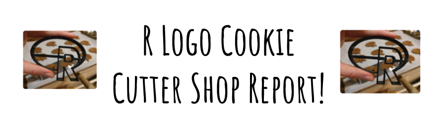

## Orders and Inventory Update

### Running Shop Totals

- **Orders:** `r orders$total_orders`
- **Total units sold:** `r orders$purple + orders$black + orders$red`

### Remaining Inventory

- **Purple filament:** `r inventory_levels$p_inventory` 
- **Black filament:** `r inventory_levels$b_inventory` 
- **Red filament:** `r inventory_levels$r_inventory` 

```{r orders_inventory, echo=FALSE, , message=FALSE, warning=FALSE}
```

